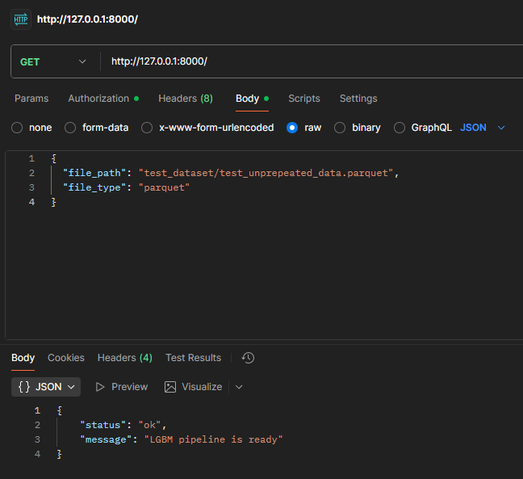
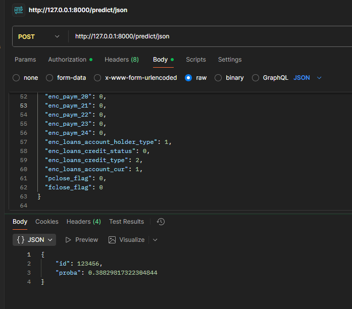
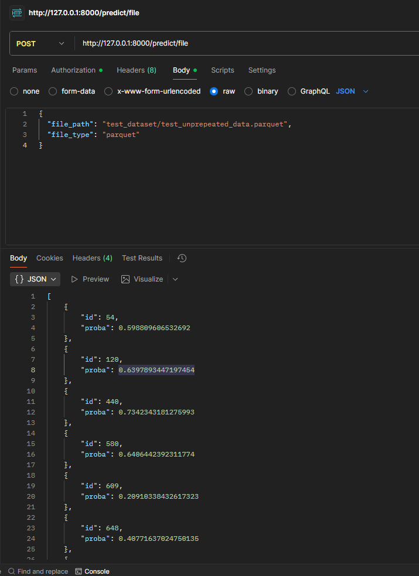

## Кредитное моделирование риска дефолта

Проект решает задачу предсказания вероятности дефолта клиента по кредиту. Он охватывает полный MLOps-цикл: исследование и подготовку данных в ноутбуке, формирование признаков и инференс в пайплайне, а также публикацию модели через FastAPI.

- **Целевая метрика:** ROC-AUC ≥ 0.75.
- **Финальная модель:** LightGBM, обученная на агрегированном датасете с OHE-кодировкой категориальных признаков и балансировкой классов downsampling-ом.
- **Основные артефакты:** `models/lgbm_final.pkl` (веса) и `models/feature_artifacts.pkl` (описание признаков и уровней категорий).

---

## Структура репозитория

- `creditRiskModeling.ipynb` – исследование данных, генерация признаков, подбор гиперпараметров, сравнение моделей.
- `pipeline.py` – продакшн-пайплайн (подготовка признаков + обёртка над LightGBM).
- `api.py` – REST API (FastAPI) с эндпоинтами для одиночных и пакетных предсказаний.
- `prepared_data/`, `train_data/`, `train_target.csv` – промежуточные и сырые датасеты.
- `models/` – обученная модель и артефакты.
- `test_dataset/` – пример набора для валидации инференса.
- `reqiurements.txt` – список зависимостей (опечатка сохранена из исходного файла).

---

## Данные

- **Исходные файлы** `train_data_*.pq` содержат историю кредитных продуктов с признаками по лимитам, просрочкам, статусам и платёжным событиям.
- **Таргет** `flag` находится в `train_target.csv`.
- В каталоге `prepared_data/` лежат четыре агрегированных датасета (`test1.parquet` ... `test4.parquet`). Финальная модель обучалась на `test4.parquet`, где:
  - категориальные признаки преобразованы через OHE (топ-30 категорий + `__OTHER__`);
  - добавлены счётчики событий по `id` и временные агрегаты.

---

## Ноутбук `creditRiskModeling.ipynb`

В ноутбуке задокументированы все этапы:

1. **EDA и очистка** – объединение паркетов, оптимизация типов, заполнение пропусков, первичная статистика.
2. **Фичеринг** – генерация агрегатов, временных признаков, one-hot encoding, балансировка классов.
3. **Сравнение моделей** – Logistic Regression, (Ridge/SGD) Linear Models, RandomForest, GradientBoosting, XGBoost, LightGBM, CatBoost. Используется стратифицированная k-fold валидация.
4. **Тюнинг LightGBM** – RandomizedSearch по 100 конфигурациям, подбор `num_leaves`, `max_depth`, `subsample`, регуляризации.
5. **Финальная проверка** – hold-out тест на 20% данных; в ноутбуке есть отчёт с ROC-AUC, PR-AUC, F1.

Чтобы воспроизвести эксперименты:

```bash
# (необязательно) создать окружение
python -m venv .venv
.venv\Scripts\activate

pip install -r reqiurements.txt
jupyter lab  # либо jupyter notebook
```

Далее откройте `creditRiskModeling.ipynb` и выполните клетки по порядку (время выполнения зависит от мощности ПК).

---

## Инференс-пайплайн (`pipeline.py`)

Класс `LgbmPipeline`:

1. Загружает веса LightGBM и артефакты фичеринга.
2. Преобразует входные записи в набор признаков (`build_features_from_df`):
   - считает количество строк на `id`;
   - кодирует категориальные признаки с учетом заранее сохранённых уровней;
   - гарантирует одинаковый набор фичей для train/inference.
3. Возвращает вероятность дефолта как `proba`.

Пример использования:

```python
from pipeline import LgbmPipeline

pipe = LgbmPipeline.from_files(
    model_path="models/lgbm_final.pkl",
    artifacts_path="models/feature_artifacts.pkl",
)

payload = {...}  # одна заявка с обязательным полем "id"
pipe.predict_one(payload)
```

Для пакетного инференса можно передать список словарей либо сразу DataFrame (`pipe.predict_batch`).

---

## REST API (`api.py`)

Сервис построен на FastAPI.

### Запуск

```bash
uvicorn api:app --reload  # или uvicorn api:app --host 0.0.0.0 --port 8000
```

При старте автоматически подгружается пайплайн из `models/`.

### Эндпоинты

- `GET /` – health-check.
- `POST /predict/json` – тело запроса: JSON одной заявки (все поля как в обучении, включая `id`). Ответ: `{"id": ..., "proba": ...}`.
- `POST /predict/file` – принимает путь к локальному файлу (`csv` или `parquet`); сервис сам загрузит его и вернёт список предсказаний. Поля:
  - `file_path` – путь;
  - `file_type` – `csv`/`parquet` (можно не указывать, определяется по расширению);
  - `sep` – разделитель для CSV.

Пример запроса:

```bash
curl -X POST http://127.0.0.1:8000/predict/json ^
     -H "Content-Type: application/json" ^
     -d "{\"id\": 100500, \"pre_loans_credit_limit\": 250000, ...}"
```

### Постман-коллекция (скриншоты)

Для быстрого знакомства с API добавлены скриншоты из Postman (папка `img/`):







---

## Использование готовых данных

- В `test_dataset/test_unprepeated_data.parquet` лежит образец «сырых» данных.
- Файл `test_dataset/test_predictions.csv` содержит эталонные ответы для проверки пайплайна (подходит для расчёта ROC-AUC, см. пример в конце `pipeline.py`).

---

